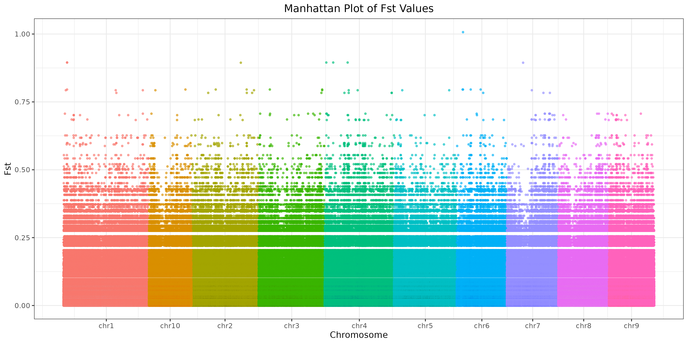

# Literature Source

**Beissinger TM, Hirsch CN, Vaillancourt B, et al.**  
*A genome-wide scan for evidence of selection in a maize population under long-term artificial selection for ear number.*  
Genetics. 2014 Mar;196(3):829-840.  

## Experimental Design

This study conducted a genome-wide selection scan in the *Golden Glow* maize population, which underwent artificial selection for increased ear number over 30 generations. A total of 48 plants were randomly chosen from cycle 0 and cycle 30. The effective population size (Ne) ranged between **384 and 667 individuals**.

## Materials and Methods

### Germplasm

- The *Golden Glow* maize population has been under selection for increased ear number since **1971**.
- The initial selection intensity was **2.5–5%** in the first 12 cycles and was later increased to **0.5–1%** from the 13th cycle onwards.

### Sequencing Method and Genome Size

- Whole-genome sequencing was performed on 48 randomly selected plants from **cycle 0** and **cycle 30** using **Illumina sequencing technology**.
- Sequencing output:
  - **Cycle 0:** 555,078,520 read pairs from eight sequencing lanes.
  - **Cycle 30:** 652,901,808 read pairs from nine sequencing lanes.

### Ancestral Species

- **Cycle 0** represents the ancestral population.
- **Cycle 30** represents the domesticated population after 30 generations of artificial selection.
- The **reference genome** used for this study was *B73 Version 2*.

# HW1
Full document is provided here: [HW1](https://1stfrom.github.io/AGRO_932_project/script/a.01.01_data_prep/a.01.01_data_info.html)

To download sequencing data and reference genome files, the following link is avaliable:

- [Reference Genome](https://download.maizegdb.org/Zm-B73-REFERENCE-NAM-5.0)
- [Cycle 0](script/a.01.01_data_prep/downloadseq0.sh)
- [Cycle 30](script/a.01.01_data_prep/downloadseq30.sh)

# HW2

HW2 is about Fst calculation between cycle 0 and cycle 30, and before that, we need to map the reads to the reference genome and do the SNP calling.

- [HW2 Map Genome](https://1stfrom.github.io/AGRO_932_project/script/b.01.01_map_ref/b.01.01_map_to_refgenome.html)
- [HW2 SNP Calling](https://1stfrom.github.io/AGRO_932_project/script/b.01.02_SNP_call/b.01.02_SNP_calling.html)
- [HW2 Fst Calculation](https://1stfrom.github.io/AGRO_932_project/script/b.01.03_Fst_cal/b.01.03_Fst_calculation.html)

